# 做对产品 — Skill Index

> 本书由 book2skill 蒸馏, 共产出 **12** 个 skills。
> 处理时间: 2026-06-06

## 关于这本书

- **作者**: Alberto Savoia / 阿尔贝托·索维亚
- **出版年**: 待确认。当前 PDF 元数据只有 2023-09-08 生成时间, 不能等同于出版年。
- **一句话主旨**: 在投入资源把产品构建正确之前, 先用可量化假说、预型试验和带切身利益的一手市场数据验证自己是否正在构建市场真正会响应的“正确的它”。
- **整书理解**: 见 [BOOK_OVERVIEW.md](./BOOK_OVERVIEW.md)

---

## Skill 列表 (按主题分组)

### 1. 风险先验与失败诊断

- [`market-failure-prior`](./market-failure-prior/SKILL.md) — 把新产品失败设为默认先验, 防止用团队能力替代市场证据。
- [`right-it-diagnosis`](./right-it-diagnosis/SKILL.md) — 区分正确的它/错误的它, 并诊断启动、运营、前提失败。
- [`escape-thoughtland`](./escape-thoughtland/SKILL.md) — 识别意见、OPD、焦点组和点赞等空想之地证据, 转向 YODA。

### 2. 假说清晰化

- [`market-engagement-hypothesis`](./market-engagement-hypothesis/SKILL.md) — 写出目标市场将如何了解、尝试、购买、使用或复购的 MEH。
- [`xyz-hypothesis`](./xyz-hypothesis/SKILL.md) — 把模糊市场判断改写为“至少 X% 的 Y 会 Z”。
- [`hypozoom-to-xyz`](./hypozoom-to-xyz/SKILL.md) — 将宽泛 XYZ 缩进为局部、快速、低成本可测试的 xyz。

### 3. 预型试验设计

- [`pretotype-yoda`](./pretotype-yoda/SKILL.md) — 设计快速、便宜、能产生切身利益 YODA 的预型试验。
- [`pretotype-technique-selection`](./pretotype-technique-selection/SKILL.md) — 按创意形态选择假门、匹诺曹、土耳其机器人、潜入者、改标签等预型技术。
- [`minimize-data-distance-hours-dollars`](./minimize-data-distance-hours-dollars/SKILL.md) — 用 DTD、HTD、$TD 选择最近、最快、最便宜且有效的数据路径。

### 4. 证据分析与迭代决策

- [`skin-in-game-caliper`](./skin-in-game-caliper/SKILL.md) — 按用户付出的金钱、时间、数据、声誉等切身利益校准证据强度。
- [`tri-meter`](./tri-meter/SKILL.md) — 将多轮 YODA 映射到 TRI 计量仪, 判断争取、调整或放弃。
- [`adjust-before-pivot`](./adjust-before-pivot/SKILL.md) — 早期 YODA 不佳时, 先小幅调整, 再翻转, 最后才放弃。

---

## 引用图

```mermaid
graph LR
    MFP["market-failure-prior"]
    RID["right-it-diagnosis"]
    ET["escape-thoughtland"]
    MEH["market-engagement-hypothesis"]
    XYZ["xyz-hypothesis"]
    HZ["hypozoom-to-xyz"]
    PY["pretotype-yoda"]
    PTS["pretotype-technique-selection"]
    MIN["minimize-data-distance-hours-dollars"]
    SIG["skin-in-game-caliper"]
    TRI["tri-meter"]
    ADJ["adjust-before-pivot"]

    RID -->|depends-on| MFP
    ET -->|depends-on| MFP
    XYZ -->|depends-on| MEH
    HZ -->|depends-on| XYZ
    PY -->|depends-on| HZ
    PTS -->|depends-on| PY
    MIN -->|depends-on| HZ
    SIG -->|depends-on| PY
    TRI -->|depends-on| SIG
    ADJ -->|depends-on| TRI

    MFP ===>|composes-with| RID
    MFP ===>|composes-with| ET
    ET ===>|composes-with| MEH
    MEH ===>|composes-with| XYZ
    XYZ ===>|composes-with| HZ
    HZ ===>|composes-with| PY
    HZ ===>|composes-with| MIN
    PY ===>|composes-with| PTS
    PY ===>|composes-with| SIG
    SIG ===>|composes-with| TRI
    TRI ===>|composes-with| ADJ

    SIG -.->|contrasts-with| ET
```



图例:
- `-->` depends-on
- `-.->` contrasts-with
- `===>` composes-with

---

## 推荐学习顺序

1. **market-failure-prior** — 先接受新产品默认高失败率。
2. **right-it-diagnosis** — 学会区分执行问题和前提问题。
3. **escape-thoughtland** — 分清意见、OPD 和真实市场行为。
4. **market-engagement-hypothesis** — 写清市场将如何参与创意。
5. **xyz-hypothesis** — 把模糊假说量化成 X/Y/Z。
6. **hypozoom-to-xyz** — 将大假说缩进为可测试的小 xyz。
7. **pretotype-yoda** — 设计预型试验获取一手市场数据。
8. **pretotype-technique-selection** — 选择适合创意形态的预型技术。
9. **minimize-data-distance-hours-dollars** — 优化测试路径, 降低距离、时间和成本。
10. **skin-in-game-caliper** — 校准每类用户行为证据的强弱。
11. **tri-meter** — 综合多轮证据, 判断创意方向。
12. **adjust-before-pivot** — 根据坏数据先调整, 再翻转, 最后放弃。

---

## 接入 darwin-skill

所有 skill 均已生成 `test-prompts.json` 和 `test-results.md`, 本轮压力测试通过率均为 100%。可接入自动进化:

```bash
darwin evolve books/zuo-dui-chan-pin/
```

---

## 审计轨迹

- 候选单元池: [candidates/](./candidates/)
- 被淘汰或降级的候选: [rejected/](./rejected/)
- 三重验证通过单元: [verified.md](./verified.md)
- BOOK_OVERVIEW: [BOOK_OVERVIEW.md](./BOOK_OVERVIEW.md)
